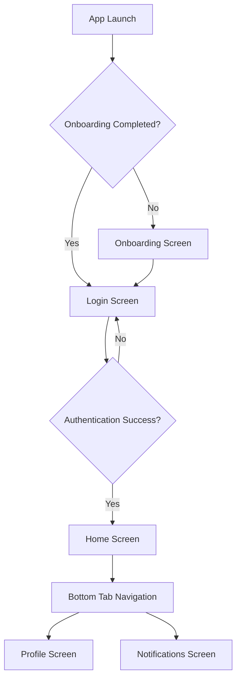

## 1. Product Overview
Enterprise-grade Expo React Native TypeScript boilerplate providing a complete foundation for mobile app development with authentication, onboarding, protected routes, notifications, and modern development practices.

This boilerplate solves the problem of repetitive setup for React Native projects by providing a production-ready foundation with clean architecture, comprehensive testing, and CI/CD integration for teams building scalable mobile applications.

## 2. Core Features

### 2.1 User Roles
| Role | Registration Method | Core Permissions |
|------|---------------------|------------------|
| Guest User | No registration required | Can view onboarding, access public routes |
| Authenticated User | Email/password login | Full app access, notifications, protected routes |

### 2.2 Feature Module
Our mobile application consists of the following main pages:
1. **Onboarding Screen**: Swipe-based tutorial flow with feature highlights
2. **Login Screen**: Modern authentication interface with form validation
3. **Home Screen**: Main dashboard with bottom tab navigation
4. **Profile Screen**: User settings and account management
5. **Notifications Screen**: Push notification history and settings

### 2.3 Page Details
| Page Name | Module Name | Feature description |
|-----------|-------------|---------------------|
| Onboarding Screen | Swipe Tutorial | Navigate through app features with smooth animations, mark completion in persistent storage |
| Login Screen | Authentication | Validate email/password inputs, handle mock API authentication, show error feedback, persist session |
| Home Screen | Dashboard | Display main content, implement hide-on-scroll bottom tab navigation, load user data |
| Profile Screen | User Management | Show user information, provide logout functionality, display app settings |
| Notifications Screen | Push Notifications | List notification history, configure notification preferences, handle notification routing |

## 3. Core Process

### Guest User Flow
User opens app → Views onboarding (first time only) → Redirected to login → Authenticates via mock API → Gains access to protected app routes → Can navigate using bottom tabs → Receives push notifications

### Authentication Flow
User enters credentials → API validates (mock) → Store auth token in Zustand → Redirect to protected routes → Auto-redirect unauthenticated users to login

## 4. User Interface Design

### 4.1 Design Style
- **Primary Colors**: Modern blue (#007AFF) for primary actions, white backgrounds
- **Secondary Colors**: Light gray (#F2F2F7) for backgrounds, dark gray (#8E8E93) for secondary text
- **Button Style**: Rounded rectangles with subtle shadows, iOS-style native appearance
- **Typography**: System fonts (SF Pro for iOS, Roboto for Android), 16px base size
- **Layout**: Card-based components with consistent spacing (8px grid system)
- **Icons**: SF Symbols for iOS, Material Icons for Android, consistent sizing (24px)

### 4.2 Page Design Overview
| Page Name | Module Name | UI Elements |
|-----------|-------------|-------------|
| Onboarding Screen | Swipe Tutorial | Full-screen cards with illustrations, page indicators, skip/next buttons, smooth transitions |
| Login Screen | Authentication | Centered card layout, email/password inputs with icons, primary login button, error message banner |
| Home Screen | Dashboard | Scrollable content area, hide-on-scroll bottom tab bar with 3 tabs, native platform styling |
| Profile Screen | User Management | Avatar display, user info cards, settings list with chevrons, logout button at bottom |
| Notifications Screen | Push Notifications | Notification list with timestamps, unread indicators, settings toggle switches |

### 4.3 Responsiveness
Mobile-first design approach with platform-specific adaptations for iOS and Android. Components scale appropriately across different screen sizes and orientations.

### 4.4 Animation Guidelines
- Smooth transitions between screens using native navigation
- Hide-on-scroll bottom tab with spring animations
- Onboarding swipe gestures with momentum scrolling
- Loading skeletons for async content