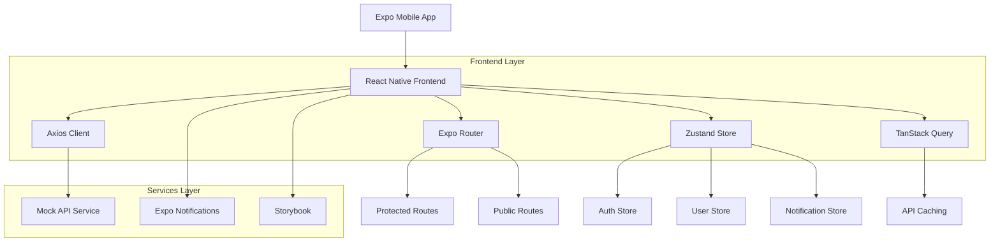
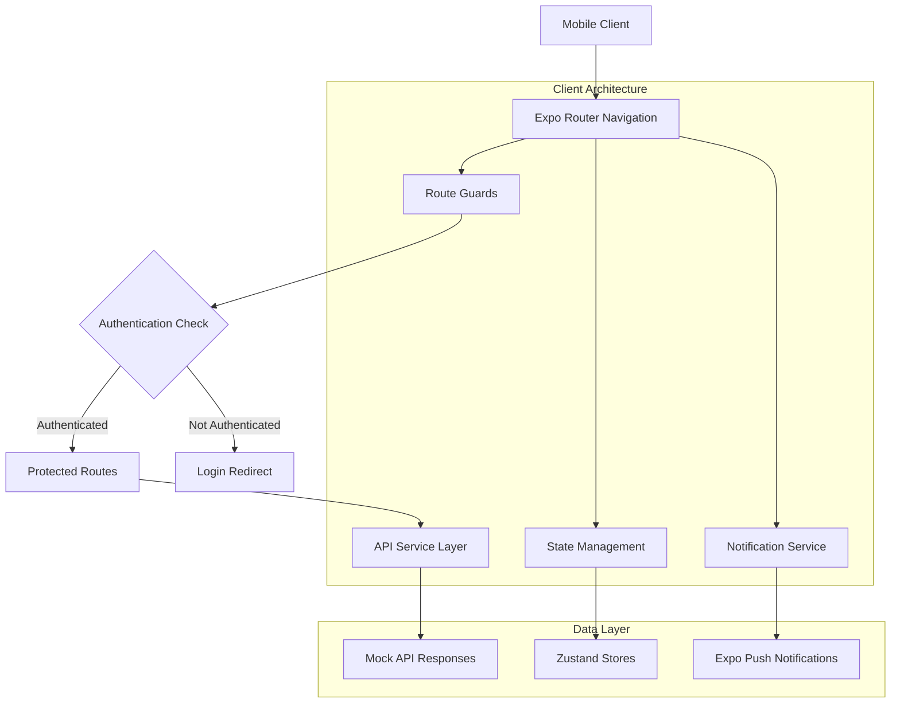
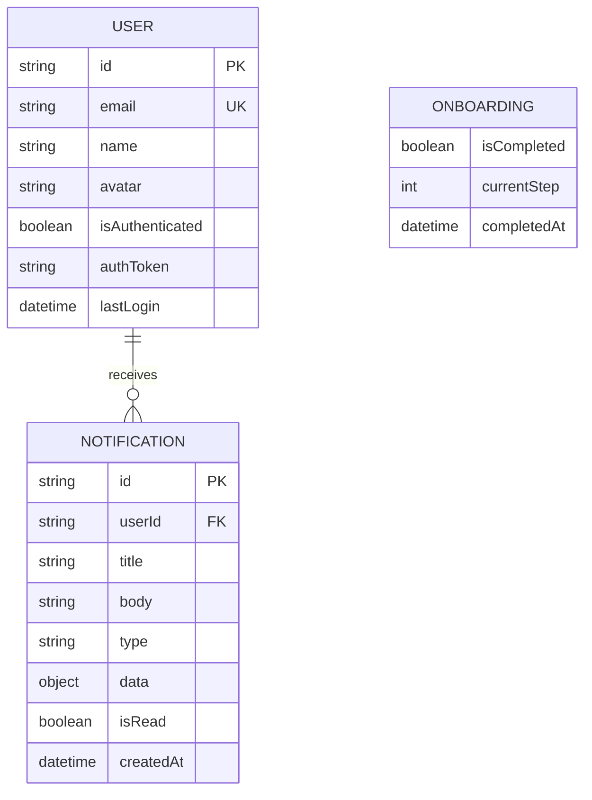

## 1. Architecture design



## 2. Technology Description
- Frontend: React Native@0.76 + Expo@54 + TypeScript@5
- Navigation: Expo Router@4
- State Management: Zustand@5
- API Caching: TanStack Query@5
- HTTP Client: Axios@1.7
- Testing: Jest@29 + React Native Testing Library@12
- UI Documentation: Storybook@7
- Notifications: Expo Notifications@0.29
- Initialization Tool: create-expo-app@latest

## 3. Route definitions
| Route | Purpose |
|-------|---------|
| /onboarding | First-time user tutorial with swipe navigation |
| /auth/login | User authentication with email/password |
| /app/(tabs)/home | Main dashboard screen with content |
| /app/(tabs)/profile | User profile and settings |
| /app/(tabs)/notifications | Push notification history |

## 4. API definitions

### 4.1 Authentication API

```
POST /api/auth/login
```

Request:
| Param Name | Param Type | isRequired | Description |
|------------|-------------|-------------|-------------|
| email | string | true | User email address |
| password | string | true | User password |

Response:
| Param Name | Param Type | Description |
|------------|-------------|-------------|
| token | string | JWT authentication token |
| user | object | User profile data |
| expiresIn | number | Token expiration time in seconds |

Example
```json
{
  "email": "user@example.com",
  "password": "password123"
}
```

### 4.2 Mock API Service
```typescript
interface MockAuthResponse {
  token: string;
  user: {
    id: string;
    email: string;
    name: string;
  };
  expiresIn: number;
}
```

## 5. Server architecture diagram



## 6. Data model

### 6.1 Data model definition


### 6.2 Data Definition Language

User Store Schema (Zustand)
```typescript
interface UserState {
  user: {
    id: string;
    email: string;
    name: string;
    avatar?: string;
  } | null;
  isAuthenticated: boolean;
  authToken: string | null;
  login: (email: string, password: string) => Promise<void>;
  logout: () => void;
  updateProfile: (userData: Partial<User>) => void;
}
```

Notification Store Schema (Zustand)
```typescript
interface NotificationState {
  pushToken: string | null;
  notifications: Notification[];
  registerPushToken: () => Promise<void>;
  addNotification: (notification: Notification) => void;
  markAsRead: (id: string) => void;
  clearNotifications: () => void;
}
```

Onboarding Store Schema (Zustand)
```typescript
interface OnboardingState {
  isCompleted: boolean;
  currentStep: number;
  completeOnboarding: () => void;
  resetOnboarding: () => void;
}
```

### 6.3 Persistent Storage Configuration
```typescript
// Zustand persist configuration
const persistConfig = {
  name: 'app-storage',
  storage: AsyncStorage,
  partialize: (state) => ({
    user: state.user,
    isAuthenticated: state.isAuthenticated,
    isOnboardingCompleted: state.isOnboardingCompleted,
    pushToken: state.pushToken,
  }),
};
```

## 7. Component Architecture

### 7.1 Atomic Design Structure
```
components/
├── atoms/
│   ├── Button/
│   ├── Input/
│   ├── Text/
│   └── Icon/
├── molecules/
│   ├── FormField/
│   ├── Card/
│   └── NotificationItem/
├── organisms/
│   ├── LoginForm/
│   ├── BottomTabBar/
│   └── NotificationList/
└── templates/
    ├── AuthLayout/
    └── AppLayout/
```

### 7.2 Feature-Based Architecture
```
src/
├── features/
│   ├── auth/
│   │   ├── screens/
│   │   ├── components/
│   │   ├── hooks/
│   │   └── services/
│   ├── notifications/
│   │   ├── screens/
│   │   ├── components/
│   │   └── services/
│   └── onboarding/
│       ├── screens/
│       └── components/
├── common/
│   ├── components/
│   ├── hooks/
│   └── utils/
└── core/
    ├── navigation/
    ├── theme/
    └── constants/
```

## 8. Testing Strategy

### 8.1 Jest Configuration
```json
{
  "preset": "jest-expo",
  "setupFilesAfterEnv": ["<rootDir>/jest.setup.js"],
  "moduleNameMapper": {
    "^@/(.*)$": "<rootDir>/src/$1"
  },
  "transformIgnorePatterns": [
    "node_modules/(?!(jest-)?react-native|@react-native|expo|@expo)"
  ]
}
```

### 8.2 Test Structure
```
tests/
├── unit/
│   ├── components/
│   ├── hooks/
│   └── stores/
├── integration/
│   ├── auth/
│   └── notifications/
└── __mocks__/
    ├── expo-notifications.ts
    ├── axios.ts
    └── zustand.ts
```

## 9. CI/CD Pipeline

### 9.1 GitHub Actions Workflow
```yaml
# .github/workflows/ci.yml
name: CI/CD Pipeline
on: [push, pull_request]
jobs:
  test:
    runs-on: ubuntu-latest
    steps:
      - uses: actions/checkout@v4
      - uses: actions/setup-node@v4
      - run: npm ci
      - run: npm run lint
      - run: npm run type-check
      - run: npm run test:coverage
  
  build:
    needs: test
    runs-on: ubuntu-latest
    steps:
      - uses: actions/checkout@v4
      - uses: expo/expo-github-action@v8
      - run: npm ci
      - run: eas build --platform all --non-interactive
```

### 9.2 EAS Build Configuration
```json
{
  "cli": {
    "version": ">= 5.0.0"
  },
  "build": {
    "development": {
      "developmentClient": true,
      "distribution": "internal"
    },
    "preview": {
      "distribution": "internal"
    },
    "production": {
      "autoIncrement": true
    }
  }
}
```

## 10. Environment Configuration

### 10.1 Environment Variables
```bash
# .env
EXPO_PUBLIC_API_URL=https://api.example.com
EXPO_PUBLIC_NOTIFICATION_SOUND=notification.wav
EXPO_PUBLIC_STORYBOOK_ENABLED=false
```

### 10.2 TypeScript Configuration
```json
{
  "extends": "expo/tsconfig.base",
  "compilerOptions": {
    "strict": true,
    "baseUrl": ".",
    "paths": {
      "@/*": ["src/*"]
    }
  }
}
```