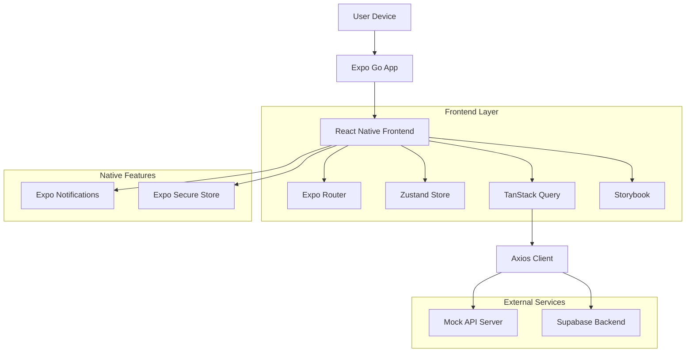
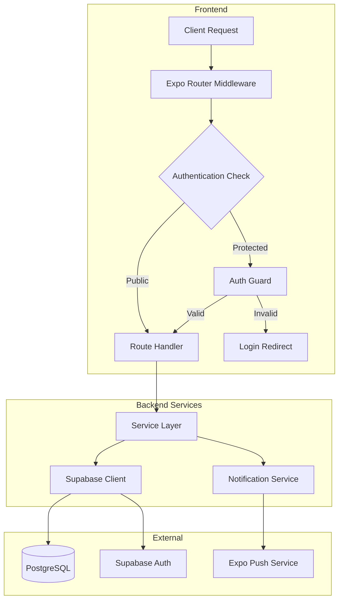
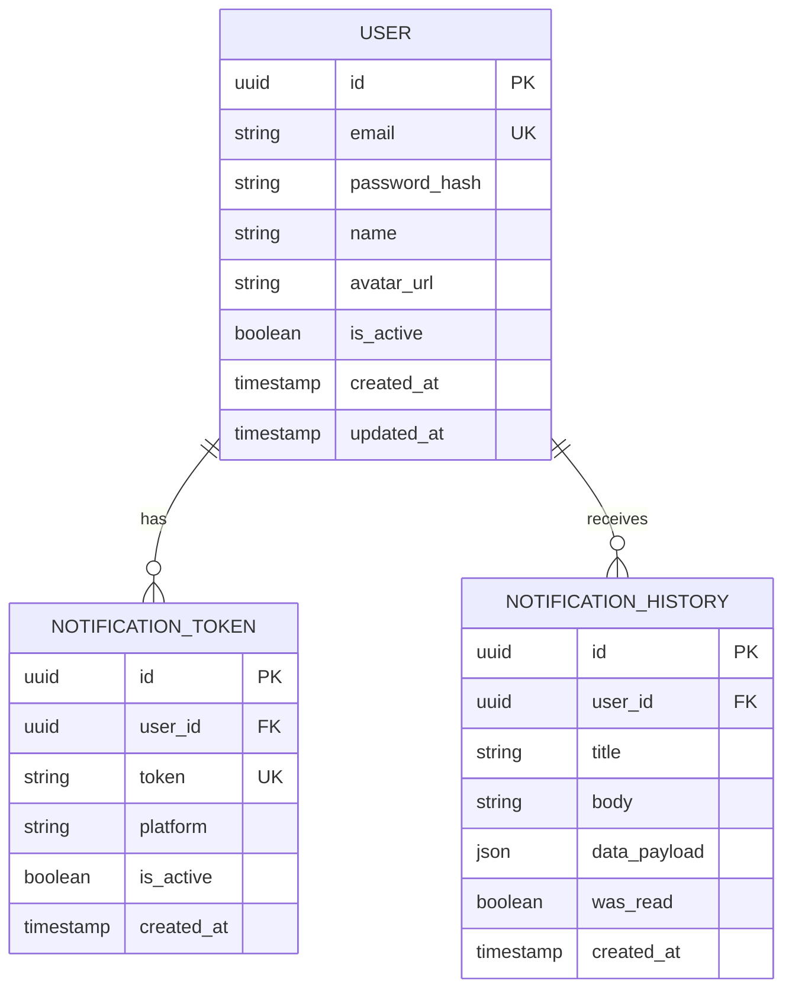

## 1. Architecture Design



## 2. Technology Description

- **Frontend**: React Native@0.76 + Expo@54 + TypeScript@5
- **Initialization Tool**: create-expo-app
- **State Management**: Zustand@4.5
- **API Client**: Axios@1.7 + TanStack Query@5.62
- **Backend**: Supabase (PostgreSQL + Auth + Storage)
- **Testing**: Jest@29 + React Native Testing Library@12
- **UI Documentation**: Storybook@7.6 (React Native Web)
- **CI/CD**: GitHub Actions + Expo EAS Build

## 3. Route Definitions

| Route | Purpose |
|-------|---------|
| /auth/login | Authentication screen for user login |
| /auth/register | User registration with email/password |
| /onboarding | Swipe-based tutorial flow for new users |
| /app/home | Main dashboard with protected content |
| /app/profile | User profile and settings management |
| /app/notifications | Push notification history and settings |
| /storybook | Component documentation and testing |

## 4. API Definitions

### 4.1 Authentication API

```
POST /api/auth/login
```

Request:
| Param Name | Param Type | isRequired | Description |
|------------|-------------|-------------|-------------|
| email | string | true | User email address |
| password | string | true | User password (min 6 chars) |

Response:
| Param Name | Param Type | Description |
|------------|-------------|-------------|
| token | string | JWT authentication token |
| user | object | User profile data |
| expiresIn | number | Token expiration in seconds |

Example:
```json
{
  "email": "user@example.com",
  "password": "securepassword123"
}
```

### 4.2 Notifications API

```
POST /api/notifications/register-token
```

Request:
| Param Name | Param Type | isRequired | Description |
|------------|-------------|-------------|-------------|
| token | string | true | Expo push notification token |
| platform | string | true | Device platform (ios/android) |

## 5. Server Architecture Diagram



## 6. Data Model

### 6.1 Data Model Definition



### 6.2 Data Definition Language

User Table (users)
```sql
-- Create table
CREATE TABLE users (
    id UUID PRIMARY KEY DEFAULT gen_random_uuid(),
    email VARCHAR(255) UNIQUE NOT NULL,
    password_hash VARCHAR(255) NOT NULL,
    name VARCHAR(100) NOT NULL,
    avatar_url TEXT,
    is_active BOOLEAN DEFAULT true,
    created_at TIMESTAMP WITH TIME ZONE DEFAULT NOW(),
    updated_at TIMESTAMP WITH TIME ZONE DEFAULT NOW()
);

-- Create indexes
CREATE INDEX idx_users_email ON users(email);
CREATE INDEX idx_users_created_at ON users(created_at DESC);

-- Grant permissions
GRANT SELECT ON users TO anon;
GRANT ALL PRIVILEGES ON users TO authenticated;
```

Notification Tokens Table (notification_tokens)
```sql
-- Create table
CREATE TABLE notification_tokens (
    id UUID PRIMARY KEY DEFAULT gen_random_uuid(),
    user_id UUID REFERENCES users(id) ON DELETE CASCADE,
    token VARCHAR(255) UNIQUE NOT NULL,
    platform VARCHAR(20) NOT NULL CHECK (platform IN ('ios', 'android')),
    is_active BOOLEAN DEFAULT true,
    created_at TIMESTAMP WITH TIME ZONE DEFAULT NOW()
);

-- Create indexes
CREATE INDEX idx_notification_tokens_user_id ON notification_tokens(user_id);
CREATE INDEX idx_notification_tokens_token ON notification_tokens(token);

-- Grant permissions
GRANT SELECT ON notification_tokens TO anon;
GRANT ALL PRIVILEGES ON notification_tokens TO authenticated;
```

Notification History Table (notification_history)
```sql
-- Create table
CREATE TABLE notification_history (
    id UUID PRIMARY KEY DEFAULT gen_random_uuid(),
    user_id UUID REFERENCES users(id) ON DELETE CASCADE,
    title VARCHAR(255) NOT NULL,
    body TEXT NOT NULL,
    data_payload JSONB,
    was_read BOOLEAN DEFAULT false,
    created_at TIMESTAMP WITH TIME ZONE DEFAULT NOW()
);

-- Create indexes
CREATE INDEX idx_notification_history_user_id ON notification_history(user_id);
CREATE INDEX idx_notification_history_created_at ON notification_history(created_at DESC);
CREATE INDEX idx_notification_history_was_read ON notification_history(was_read);

-- Grant permissions
GRANT SELECT ON notification_history TO anon;
GRANT ALL PRIVILEGES ON notification_history TO authenticated;
```