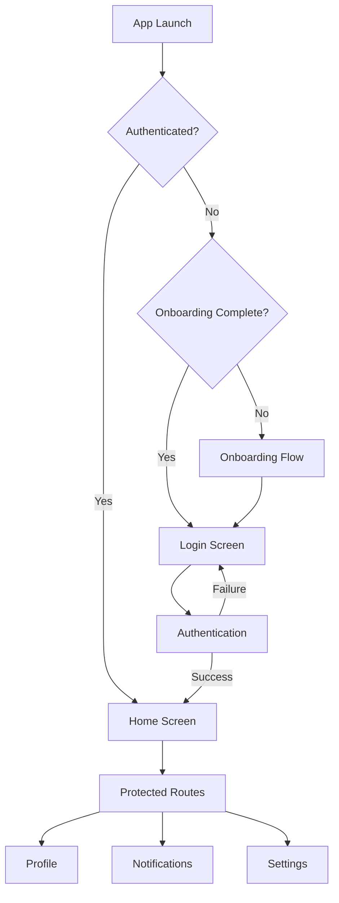

## 1. Product Overview
Enterprise-grade Expo + React Native boilerplate providing production-ready foundation for mobile applications. Solves common development challenges with authentication, notifications, testing, and deployment infrastructure.

Target audience: Development teams building scalable React Native applications requiring enterprise-level architecture and best practices.

## 2. Core Features

### 2.1 User Roles
| Role | Registration Method | Core Permissions |
|------|---------------------|------------------|
| Authenticated User | Email/password login | Access protected app features, receive notifications |
| Guest User | Anonymous browsing | View onboarding flow only |

### 2.2 Feature Module
The boilerplate consists of the following main pages:
1. **Onboarding Screen**: Swipe-based tutorial flow, appears once per installation
2. **Login Screen**: Modern authentication interface with form validation
3. **Registration Screen**: User account creation with validation
4. **Home Screen**: Main dashboard with protected content
5. **Profile Screen**: User settings and account management
6. **Notifications Screen**: Push notification history and settings

### 2.3 Page Details
| Page Name | Module Name | Feature description |
|-----------|-------------|---------------------|
| Onboarding Screen | Tutorial Flow | Swipe through app features, skip option, completion tracking |
| Onboarding Screen | Progress Indicator | Visual progress dots, automatic navigation |
| Login Screen | Authentication Form | Email/password inputs, validation, error handling |
| Login Screen | Mock API Integration | Simulated login with success/error responses |
| Login Screen | Session Management | Secure token storage, auto-login on app restart |
| Home Screen | Dashboard Content | Protected route content, user greeting |
| Home Screen | Navigation Header | Hide-on-scroll functionality with smooth animations |
| Profile Screen | User Information | Display user data, logout functionality |
| Notifications Screen | Push History | List received notifications, tap to navigate |
| Notifications Screen | Settings | Toggle notification preferences, sound selection |
| Tab Navigation | Bottom Tabs | Animated hide/show on scroll, smooth transitions |

## 3. Core Process

### User Authentication Flow
1. App launches → Check authentication status
2. If authenticated → Navigate to /app/home
3. If new user → Show onboarding → Navigate to login
4. If unauthenticated → Navigate to /auth/login
5. Login success → Store token → Navigate to /app/home
6. Logout → Clear token → Navigate to /auth/login

### Notification Flow
1. App requests notification permissions on first launch
2. Register device push token with backend
3. Store token in Zustand for app-wide access
4. Handle foreground/background notifications
5. Navigate to specific screens based on notification data

## 4. User Interface Design

### 4.1 Design Style
- **Primary Colors**: Deep blue (#1E40AF) for primary actions, white (#FFFFFF) for backgrounds
- **Secondary Colors**: Light gray (#F3F4F6) for cards, green (#10B981) for success states
- **Button Style**: Rounded corners (8px), subtle shadows, gradient backgrounds
- **Typography**: System fonts with hierarchy - 24px headers, 16px body, 14px captions
- **Layout**: Card-based design with generous spacing (16px padding standard)
- **Icons**: Feather icons for consistency, colored based on state
- **Animations**: Smooth transitions (300ms), parallax scrolling effects

### 4.2 Page Design Overview
| Page Name | Module Name | UI Elements |
|-----------|-------------|-------------|
| Onboarding Screen | Tutorial Cards | Full-screen gradient backgrounds, swipe indicators, animated illustrations |
| Login Screen | Form Container | Rounded card with shadow, input fields with icons, primary CTA button |
| Home Screen | Dashboard | Grid layout for features, user avatar top-right, scrollable content |
| Tab Navigation | Bottom Bar | Floating tab bar, hide-on-scroll animation, active tab highlighting |
| Notifications | List View | Card-based notification items, timestamp badges, unread indicators |

### 4.3 Responsiveness
Desktop-first design approach with mobile-optimized layouts. Components scale appropriately across device sizes. Touch targets minimum 44px for accessibility. Landscape/portrait orientation support with proper content reflow.

### 4.4 Animation Guidelines
- Page transitions: Slide animations (250-300ms)
- Button interactions: Scale and opacity changes
- Scroll animations: Parallax effects for hero sections
- Loading states: Skeleton screens with shimmer effects
- Tab navigation: Smooth hide/show with transform animations